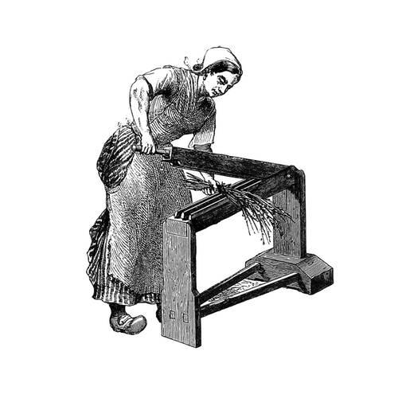

```{r setup, include=FALSE}
options(htmltools.dir.version = FALSE)
knitr::opts_chunk$set(collapse = TRUE,
                      fig.retina = 3)

library(ymlthis)
library(tidyverse)
library(xaringanExtra)
library(palmerpenguins)
xaringanExtra::use_panelset()
xaringanExtra::use_share_again()
xaringanExtra::style_share_again(
  share_buttons = c("twitter", "linkedin", "pocket")
)
```

```{r broadcast, echo=FALSE}
xaringanExtra::use_broadcast()
```

class: title-slide, center, bottom

# `r rmarkdown::metadata$title`

## `r rmarkdown::metadata$subtitle`

### `r rmarkdown::metadata$author`

???

Welcome to the webinar on sharing on short notice

Where we'll show you how to get your teaching materials online with R Markdown.

---
layout: true

<a class="footer-link" href="https://rstd.io/tip">rstd.io/tip</a>

---
name: clouds
class: center, middle
background-image: url(images/clouds.jpg)
background-size: cover

```{css, echo=FALSE}
.panelset {
  --panel-tab-font-family: Work Sans;
  --panel-tab-background-color-active: #fffbe0;
  --panel-tab-border-color-active: #023d4d;
}

.panelset .panel-tabs .panel-tab > a {
	color: #023d4d;
}
```

```{r meta, echo=FALSE}
library(metathis)
meta() %>%
  meta_general(
    description = "Make your teaching more robust & reproducible with R Markdown",
    generator = "xaringan and remark.js"
  ) %>% 
  meta_name("github-repo" = "rstudio-education/teaching-in-production") %>% 
  meta_social(
    title = "Teaching in production",
    url = "https://rstd.io/tip",
    image = "https://repository-images.githubusercontent.com/288797104/d13f1700-e2cc-11ea-9ed7-0bf3a41af1e4",
    image_alt = "R Markdown hedgehog by Allison Horst",
    og_type = "website",
    twitter_card_type = "summary_large_image"
  )
```

---
template: clouds

## .big-text[Hello.]

???

So hello- I'm so happy to be invited to join you all today.

---
name: clouds
background-image: url(images/clouds.jpg)
background-size: cover

---
name: hello
template: clouds
class: middle, center


### Alison Hill 


[`r icon::fa("github")` @apreshill](https://github.com/apreshill)  
[`r icon::fa("twitter")` @apreshill](https://twitter.com/apreshill)  
[`r icon::fa("link")` alison.rbind.io](https://alison.rbind.io)


???

My name is Alison Hill, and I'm a data scientist and professional educator at RStudio.


---
class: freight-slide, center, middle, inverse

# .shadow-text[I teach a lot.]


---
class: freight-slide, center, middle, inverse

# .shadow-text[I teach a lot.]

https://ohsu-conj620.netlify.com/

https://apreshill.github.io/data-vis-labs-2018/

https://ohsu-math630.netlify.com/

https://alison.rbind.io/project/tidyml/

https://conf20-intro-ml.netlify.com/

https://summer-of-blogdown.netlify.com/

https://alison.rbind.io/project/rmd4medicine/

all here: https://alison.rbind.io/projects/


???

All of these are courses or workshops that I have developed and taught. Sometimes, I've taught them more than once. Others, just the one time.

Each site was built using R Markdown, with different tools chosen depending on what we needed.

---
template: clouds
class: middle, center

## Who are you?

---
class: middle, center

<div class="flex" style="margin: 0 1em;">
  <div class="column">
    <h3> You're an educator <h3>
    
  </div>
  
???


Here's who I know you are...

You're an educator
  
--

   <div class="column"style="margin: 0 1em;">
    <h3> You know R Markdown  </h3>
    
  </div>
  

???

You have R Markdown files for teaching...


---
class: middle, center


<div class="flex" style="margin: 0 1em;">
  <div class="column">
    <h3> You're an educator </h3>
    
  </div>
  
  <div class="column"style="margin: 0 1em;">
    <h3> You know R Markdown </h3>
    
  </div>
  

--
  <div class="column" style="margin: 0 1em;">
    <h3> You work really hard </h3>
    
  </div>
</div>

???

Maybe sometimes too hard.

---
class: center
background-image: url("images/rmd_flowchart.png")
background-size: contain
background-color: #f6f6f6

---
class: center
background-image: url("images/lesson-time.jpg")
background-size: contain
background-color: #f6f6f6

## How it feels

???

As educators, you create a ton of materials. Slides, notes, exercises.


---
background-image: url(images/Whisper.jpg)
background-size: contain

<div class="word-bubble" style="
  position: absolute; 
  text-align: center;
  width: 50%; 
  top: 100px;
  left: 310px;
  font-size: 1.3em;
"> We need to talk about <br> your teaching workflow. </div>

---

# Do you teach code?

.panelset[
.panel[.panel-name[Pop quiz]

```{r eval=FALSE}
penguins %>% 
  dplyr::n_distinct(species)
```
]

.panel[.panel-name[Answer]

```{r error=TRUE}
penguins %>% 
  dplyr::n_distinct(species)
```
]

.panel[.panel-name[Solution]

```{r error=TRUE}
n_distinct(penguins$species)
penguins %>% 
  distinct(species) %>% 
  tally()
```
<https://gist.github.com/apreshill/d9107e054f3358d438e04a582b76f7cc>
]
]

---

# Do you teach code?

.panelset[
.panel[.panel-name[Pop quiz]

```{r eval=FALSE}
penguins %>% 
  group_by(species) %>% 
  summarize(across(where(is.numeric), mean(na.rm = TRUE)))
```
]

.panel[.panel-name[Answer]

```{r error=TRUE}
penguins %>% 
  group_by(species) %>% 
  summarize(across(where(is.numeric), mean(na.rm = TRUE)))
```
]

.panel[.panel-name[Solution]

```{r error=TRUE}
penguins %>% 
  group_by(species) %>% 
  summarize(across(where(is.numeric), mean, na.rm = TRUE))
```
]
]

---

# Do you teach data visualization?

.panelset[
.panel[.panel-name[Pop quiz]

.pull-left[
```{r stack-hist, warning=FALSE, message=FALSE, fig.show='hide'}
# Histogram example: flipper length by species
ggplot(data = penguins, 
       aes(x = flipper_length_mm)) +
  geom_histogram(
    aes(fill = species), 
    alpha = 0.5) +
  scale_fill_manual(values = c("darkorange","darkorchid","cyan4"))
```

]

.pull-right[
```{r dodge-hist, echo=FALSE, warning=FALSE, message=FALSE, out.width='80%'}
# Histogram example: flipper length by species
ggplot(data = penguins, 
       aes(x = flipper_length_mm)) +
  geom_histogram(
    aes(fill = species), 
    alpha = 0.5, 
    position = "identity") + #<<
  scale_fill_manual(values = c("darkorange","darkorchid","cyan4"))
```

]
]

.panel[.panel-name[Answer]

.pull-left[
```{r ref.label='stack-hist', fig.show='hide', warning=FALSE, message=FALSE}

```


]

.pull-right[
```{r ref.label='stack-hist', out.width='80%', echo=FALSE, warning=FALSE, message=FALSE}

```
]

]

.panel[.panel-name[Solution]

.pull-left[
```{r ref.label='dodge-hist', fig.show='hide', warning=FALSE, message=FALSE}

```
]

.pull-right[
```{r ref.label='dodge-hist', out.width='80%', echo=FALSE, warning=FALSE, message=FALSE}

```
]


]
]


---

# Do you teach literate programming?

```{r flipper-hist, include=FALSE}
flipper_hist <- ggplot(data = penguins, aes(x = flipper_length_mm)) +
  geom_histogram(aes(fill = species),
                 alpha = 0.5,
                 position = "identity") +
  scale_fill_manual(values = c("darkorange","purple","cyan4")) +
  theme_minimal() +
  labs(x = "Flipper length (mm)",
       y = "Frequency")

flipper_hist
```


.panelset[
.panel[.panel-name[Pop quiz]

````
`r ''````{r, fig.caption="Why no caption?"}
flipper_hist
```
````
]

.panel[.panel-name[Answer]

.pull-left[
````
`r ''````{r, fig.caption="Why no caption?"}
flipper_hist
```
````

]

.pull-right[
```{r echo=FALSE, out.width="80%", fig.caption="Why no caption?", warning=FALSE, message=FALSE}
flipper_hist
```
]

]

.panel[.panel-name[Solution]

.pull-left[

````
`r ''````{r, fig.cap="Yes caption!"}
flipper_hist
```
````

]

.pull-right[

```{r echo=FALSE, out.width="70%", fig.cap="Yes caption!", warning=FALSE, message=FALSE}
flipper_hist
```

]

]
]


---

# YAML


---
class: left, middle
background-image: url(images/scream.jpg)
background-size: contain
background-position: right

.pull-left[
These moments happen to every educator.

You may just not know it if:

+ folks were not ACTUALLY following along,

+ folks didn't feel comfortable speaking up,

+ folks didn't have a way to speak up

]

---
name: surprise
class: right, middle
background-image: url(images/santa-reveal.jpg)
background-size: contain
background-position: left

.pull-right[
### WHAT IF I TOLD YOU...
]

---
name: surprise2
template: surprise

.pull-right[
The tools you teach learners to use...
]

---
name: surprise3
template: surprise2

.pull-right[
are the same tools **you** can use to teach.
]

---
template: surprise3

.pull-right[
# `r emo::ji("exploding_head")`
]

---
background-image: url(images/rmd-friends.jpg)
background-size: 50%
background-position: middle, center
class: top, center

# It's all R Markdown

---
background-image: url(images/rmarkdown_hedgehog_wide.png)
background-size: contain
background-position: middle, center


---
class: bottom, center
background-color: #e6f3fc
background-image: url(images/rmarkdown_hedgehog.png)
background-size: 25%
background-position: 50% 20%


# Teaching in Production

--

Tip #1: Use R Markdown to make slides with [xaringan](https://github.com/yihui/xaringan)

--

Tip #2: Use R Markdown to make a shareable site with [distill](https://rstudio.github.io/distill/)

--

Q & A


---
class: inverse, center, middle

# TIP #1: 

--

# Use R Markdown to

# make slides with xaringan

---

# The package

```{r eval=FALSE}
# install.packages("xaringan")
library(xaringan)
```


---

# The output format

```{r echo=FALSE}
yml_empty() %>%
  yml_output(xaringan::moon_reader()) %>% 
  asis_yaml_output()
```


---

# Making new slides

.pull-left[
- Slide 1 starts where YAML ends

- 3 dashes in a row `---` on a line by itself is a new slide 
]

.pull-right[
```
---
output: xaringan::moon_reader 
---

Hello I'm slide 1

---

And I'm slide 2

```
]

---

# Using markdown

.pull-left[
Fair game:

+ headers (`#`, etc.)

+ `**bold**`

+ `*italics*`

+ lists (like this one!)

]

.pull-right[
```
---
output: xaringan::moon_reader 
---

# Intro 

Hello I'm **slide** 1

---

# About *me*

And I'm slide 2

```
]

---

# Each slide has its own YAML

.pull-left[
Change slide properties with the `class` key:

+ top
+ bottom
+ middle

<hr>

+ left
+ right
+ center

<hr>
+ inverse

]

.pull-right[
```
---
output: xaringan::moon_reader 
---
class: center, middle, inverse

# Intro 

Hello I'm **slide** 1

---
class: bottom, right

# About *me*

And I'm slide 2

```
]

---
class: inverse, center, middle

# PRO-TIP: 

# Leverage remark.js

<https://arm.rbind.io/slides/xaringan.html#block1>

---
class: inverse, middle, center
background-color: #e6f3fc

# xaringan demo

---
name: yt1
class: inverse, middle
background-color: #e6f3fc

```{r include=FALSE}
yt <- 0
```

# Your turn #`r (yt <- yt + 1)`

Add content to your slide deck. Need some inspiration? Check out:

<https://allisonhorst.github.io/palmerpenguins/articles/intro.html>

Try:

+ Use my [YAML](#penguin-yaml)
+ Jumping to [named slides](https://arm.rbind.io/slides/xaringan.html#43) ([`hello`](#hello), [`goodbye`](#goodbye))
+ Present to each other with [keyboard shortcuts](https://arm.rbind.io/slides/xaringan.html#44)
+ [Incremental reveals](https://arm.rbind.io/slides/xaringan.html#61)
+ [Two columns](https://arm.rbind.io/slides/xaringan.html#66)
+ Highlight [code input](https://arm.rbind.io/slides/xaringan.html#78) or [output](https://arm.rbind.io/slides/xaringan.html#79)

```{r echo=FALSE}
countdown::countdown(minutes = 10)
```

---
name: penguin-yaml

Jump back to [Your turn #`r yt`](#yt1)

```{r echo=FALSE}
yml() %>% 
  yml_title("Presenting the penguins") %>% 
  yml_output(
    xaringan::moon_reader(
      css = c("default", "rladies", "rladies-fonts"),
      nature = list(
        highlightStyle = "github",
        highlightLines = TRUE
      )
    )
  ) %>% 
  asis_yaml_output()
```

---
class: inverse, center, middle

# PRO-TIP: 

# Power up R Markdown and knitr

---

# Side-by-side code + plot

Why? Don't repeat yourself!

--


1. Code first, plot second

    - Chunk 1: `` {r plot-last, fig.show = 'hide'} ``
    - Chunk 2: `` {r ref.label = 'plot-last', echo = FALSE} ``
    
--

1. Plot first, code second

    - Chunk 1: `` {r plot-first, echo = FALSE} ``
    - Chunk 2: `` {r ref.label = 'plot-first', fig.show = 'hide'} ``


---

## Code first, plot second

.panelset[
.panel[.panel-name[What you type]

````
.pull-left[
```{r plot-last, fig.show = 'hide'}`r ''`
code goes here
```
]
.pull-right[
```{r ref.label = 'plot-last', echo = FALSE}`r ''`
```
]
````
]

.panel[.panel-name[What you see]

```{r include=FALSE}
library(babynames)
```


.pull-left[
```{r plot-last, fig.show = 'hide'}
tx_names <- babynames %>%
  filter(name == "Dallas" | 
           name == "Austin") %>% 
  filter(sex == "F")
tx_plot <- 
  ggplot(tx_names, 
         aes(x = year, 
             y = prop,  
             group = name, 
             color = name)) + 
  geom_line() 
tx_plot
```
]

.pull-right[
```{r ref.label = 'plot-last', echo = FALSE, fig.retina = 3, out.width='80%'}
```
]
]
]


---

## Plot first, code second

.panelset[
.panel[.panel-name[What you type]

````
.pull-left[
```{r plot-first, echo = FALSE}`r ''`
code goes here
```
]
.pull-right[
```{r ref.label = 'plot-first', fig.show = 'hide'}`r ''`
```
]
````
]

.panel[.panel-name[What you see]


.pull-left[

```{r plot-last, echo = FALSE, fig.retina = 3, out.width='80%'}
```

]

.pull-right[

```{r ref.label = 'plot-last', fig.show = 'hide'}
```
]
]
]

---

# Your turn counter

.panelset[
.panel[.panel-name[What you type]

````
`r ''````{r, include=FALSE}
yt <- 0
```
````


\# Your turn \# `` `r
(yt <- yt + 1)` ``

Try this!

\# Your turn \# `` `r
(yt <- yt + 1)` ``

Check this!

]

.panel[.panel-name[What you see]

```{r include=FALSE}
yt <- 0
```


# Your turn # `r (yt <- yt + 1)`

Try this!

# Your turn # `r (yt <- yt + 1)`

Check this!
]

.panel[.panel-name[Example]

.pull-left[
```{r echo=FALSE}
knitr::include_url("https://tmv.netlify.app/slides/01-model#28")
```
]

.pull-right[
```{r echo=FALSE}
knitr::include_url("https://tmv.netlify.app/slides/01-model#33")
```
]

]

]


---

# Use your YAML


.panelset[
.panel[.panel-name[What you type]

Hi my name is `` `r
rmarkdown::metadata$author` ``, and welcome to `` `r
rmarkdown::metadata$title` ``.


]

.panel[.panel-name[What you see]

Hi my name is `r rmarkdown::metadata$author`, and welcome to 
`r rmarkdown::metadata$title`.
]
]

---

# Use `params` to wrangle your links `r emo::ji("rocket")`


.panelset[
.panel[.panel-name[YAML]

```{r echo=FALSE}
yml_empty() %>%
  yml_output(xaringan::moon_reader()) %>% 
  yml_params(
    wifi_name = "TBD",
    wifi_pass = "penguins-are-the-new-iris",
    cloud_link = "RStudio Cloud link here",
    repo_link = "Link to Github here",
    site_link = "rstd.io/tip"
  ) %>% 
  asis_yaml_output()
```


]

.panel[.panel-name[What you type]

```
## Wifi password
```

`` `r
params$wifi_pass` ``


]

.panel[.panel-name[What you see]


## Wifi password

`r params$wifi_pass`

]

]


---
class: middle, center
background-image: url("images/short1.jpg")
background-size: cover

# [Sharing on **short notice**](https://rstd.io/sharing)

???

**R Markdown tools** you can use to get your course materials...

---
class: middle, center
background-image: url("images/short2.jpg")
background-size: cover

# [Sharing on **short notice**](https://rstd.io/sharing)

???

**online**...

---
class: middle, center
background-image: url("images/short3.jpg")
background-size: cover

# [Sharing on **short notice**](https://rstd.io/sharing)

???

on **short notice**.

---
class: center, middle

# Packages that play well with xaringan

`r emo::ji("package")` [xaringanthemer](https://pkg.garrickadenbuie.com/xaringanthemer/)

`r emo::ji("package")` [xaringanExtra](https://pkg.garrickadenbuie.com/xaringanExtra/)

`r emo::ji("package")` [countdown](https://pkg.garrickadenbuie.com/countdown/#1)

`r emo::ji("package")` [flair](https://kbodwin.github.io/flair/index.html)

`r emo::ji("package")` [ymlthis](https://ymlthis.r-lib.org/)

`r emo::ji("package")` [metathis](https://pkg.garrickadenbuie.com/metathis/)

---
background-image: url(images/ship.jpg)
background-size: contain
background-position: left
class: middle

.right-column[
### Deep thoughts on R Markdown slides

+ "If it knits, it ships"

+ Resist the `eval=FALSE` urge, try instead: 
    + `include=FALSE`
    + `error=TRUE`
    + `results='hide'`
    + `fig.show='hide'`

]

---
background-image: url(images/warning.jpg)
background-size: contain
background-position: left
class: middle

.pull-right[
### And now, a warning


<blockquote class="twitter-tweet"><p lang="en" dir="ltr">🧠: You just wasted 4 hours tweaking css and changing colors<br><br>Me: It&#39;s SLIDECRAFT!</p>&mdash; aden_buie(&quot;garrick&quot;) (@grrrck) <a href="https://twitter.com/grrrck/status/1159087961931169795?ref_src=twsrc%5Etfw">August 7, 2019</a></blockquote> <script async src="https://platform.twitter.com/widgets.js" charset="utf-8"></script> 


]

---
class: inverse, center, middle

# TIP #2: 

--

# Use R Markdown to 

# make a shareable site with distill

---

# The package

```{r eval=FALSE}
# install.packages("distill")
library(distill)
```


---

# The output format

```{r eval=FALSE}
---
site: distill::distill_website
---
```

---
background-image: url(images/Whisper.jpg)
background-size: contain

<div class="word-bubble" style="
  position: absolute; 
  text-align: center;
  width: 50%; 
  top: 100px;
  left: 310px;
  font-size: 1.3em;
"> Why do you insist on <br> websites for teaching? </div>

---
background-image: url(images/fortify.jpg)
background-size: cover

---
class: middle, center
template: clouds

<https://rstudio.github.io/distill/>

<video width="1094" height="600" controls>
    <source src="https://rstudio-education.github.io/sharing-short-notice/images/distill-tour.mp4" type="video/mp4"> </video>

???

This is a distill website.

The style is not easy to change without CSS, but it looks pretty slick out-of-the-box.

Think of distill as the nerdier sibling of an R Markdown site- it is built for technical and scientific communication. 

For example...

---
class: middle, center
template: clouds

<https://rstudio.github.io/distill/>


???

There's a way to list multiple authors and their affiliations...

---
class: middle, center
template: clouds

<https://rstudio.github.io/distill/>


???

You can include footers and asides...

---
class: middle, center
template: clouds

<https://rstudio.github.io/distill/>


???

And you can display reuse licenses for your educational content.


---
background-image: url(images/clouds.jpg)
background-size: cover


--


--


--


???

Quick things to notice -- let's look inside.

---
class: middle
background-image: url(images/hello-index.jpg)
background-position: right
background-size: 60%


.left-column[
```{r eval=FALSE}
.
├── DataViz.Rproj
├── _site.yml 
└── index.Rmd #<<
```
]

???

The index page in a distill site will work just the same as in an R Markdown site. 

It will be the site's home page. 

Any existing R Markdown document you have will do.

But there is one addition we make inside of this file. 

---
background-image: url(images/clouds.jpg)
background-size: cover
## Inside the `index.Rmd`

.left-column[
```{r eval=FALSE}
.
├── DataViz.Rproj
├── _site.yml 
└── index.Rmd #<<
```
]

.right-column[
```{r eval=FALSE}
---
title: Intro to Data Visualization
description: Spring 2020 Course Website
author:
  - name: Alison Hill
    affiliation: RStudio
  - name: Desirée De Leon
    affiliation: Teacup Giraffes, Inc.
site: distill::distill_website #<<
---

# Welcome to the course!
```
]


???

`site: distill::distill_website` should be added to the YAML.

Including a title and short description is nice too. 

[*note*: `site: distill::website` is only necessary if you wanna make the blog later]

---
background-image: url(images/rawpixel/bunch-balloons-rmd2.jpg)
background-position: right
background-size: contain

## .hidden[Inside the `_site.yml`]

.left-column[
```{r eval=FALSE}
.
├── DataViz.Rproj
├── _site.yml #<<
├── index.Rmd
├── lab01.Rmd
├── lab02.Rmd 
└── project.Rmd 
```

]

???

Next we move on to the `_site.yml` page. 
It's still for site configuration. This should sound a bit familiar...

---
background-image: url(images/Clouds2.jpg)
background-size: cover
## Inside the `_site.yml`

.left-column[
```{r eval=FALSE}
.
├── DataViz.Rproj
├── _site.yml #<<
├── index.Rmd
├── lab01.Rmd
├── lab02.Rmd 
└── project.Rmd 
```

]

.right-column[

```{r eval = FALSE}
title: DataViz 
navbar:
  right:
    - text: Labs
      menu:
      - text: Lab 1
        href: lab01.html
      - text: Lab 2
        href: lab02.html
    - text: Project
      href: project.html
output: distill::distill_article #<<
```
]


???

The YAML navbar keys here are all similar to what we used in an R Markdown site, with one important change:

The output **must** specify that this is a Distill article.

---
## Build your site

.left-column[

```{r eval=FALSE}
.
├── DataViz.Rproj
├── _site/ #<<
├── _site.yml 
└── index.Rmd 
```
]

.right-column[

]


???

So now let's build a minimal Distill site of our own. 

Just like we did with the R Markdown site, we use the build tab to knit all our files at once.

This creates a `_site` folder for our HTML files.

---
class: inverse, middle
background-color: #e6f3fc

# <center>distill demo</center>

```{r eval=FALSE}
distill::create_website(dir = ".", 
                        title = "penguin-eda",
                        gh_pages = TRUE)
```


---
name: yt2
class: inverse, middle
background-color: #e6f3fc

# Your turn # 2

Let's add a xaringan slide deck to our distill site (see `_site.yml` below), and link to it from the `index.Rmd`.

```{r echo=FALSE}
yml_empty() %>% 
  yml_site_opts(
    output_dir = "docs",
    include = "slides/"
    ) %>% 
  asis_yaml_output()
```

Do we have time? Are we feeling brave? Permission to deploy??


```{r echo=FALSE}
countdown::countdown(minutes = 15)
```

---
background-image: url(images/ship.jpg)
background-size: contain
background-position: left
class: middle

.right-column[
### Deep thoughts on Distill sites

+ [KISS principle](https://en.wikipedia.org/wiki/KISS_principle)

+ Nice features out-of-the-box

+ Can have [blog-like collections](https://rstudio-education.github.io/sharing-short-notice/#103)

+ `r emo::ji("sad")` Less flexible than a Hugo site (example [here](https://share-blogdown.netlify.app/))

+ `r emo::ji("tada")` Less dependencies than a Hugo site

]

---
background-image: url(images/warning.jpg)
background-size: contain
background-position: left
class: middle

.pull-right[
### And now, a warning

+ Care & feeding

+ ~~Slidecraft~~ Sitecraft is hard

]

---
class: middle, center, inverse

# What questions do you have?

---
name: goodbye
class: right, bottom
background-color: #e6f3fc
background-image: url(images/rmarkdown_hedgehog.png)
background-size: 25%
background-position: bottom left


# Thank you!

All art by [Allison Horst](https://www.allisonhorst.com/) & [Desirée De Leon](https://desiree.rbind.io/)

### Find me at...

[`r icon::fa("twitter")` @apreshill](http://twitter.com/apreshill)  
[`r icon::fa("github")` @apreshill](http://github.com/apreshill)  
[`r icon::fa("link")` alison.rbind.io](https://alison.rbind.io)  
[`r icon::fa("paper-plane")` alison@rstudio.com](mailto:alison@rstudio.com)
